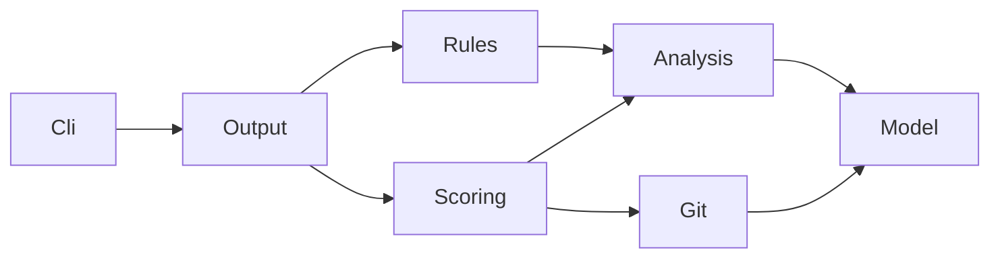

# dotnet-coupling

> A static-analysis CLI that visualizes and scores coupling in .NET solutions, quantifying architectural health.

`dotnet-coupling` extracts type-to-type and project-to-project coupling from a .NET solution using Roslyn semantic analysis, then scores risk along three axes: **Strength, Distance, and Volatility**.

Wired into a CI pipeline, it detects architectural erosion quantitatively and acts as a quality gate.

## Features

- 🔍 **Semantic dependency analysis** — accurate type resolution via Roslyn `MSBuildWorkspace`
- 📊 **Risk scoring** — a Strength × Distance × Volatility model
- 🏷️ **Grading** — the whole repository graded A–F (CI-gate ready)
- 🔥 **Hotspot detection** — pinpoints the highest-risk couplings
- ⚠️ **Rule violations** — layer / circular / concrete-dependency rules
- 📁 **Multiple outputs** — Console / JSON / Markdown
- 🌿 **Git integration** — folds the last 90 days of change frequency into Volatility
- 🛡️ **Fallback** — degrades to syntax-only mode when semantic analysis fails

## Next steps

- [Getting Started](/en/getting-started) — from install to your first analysis
- [CLI Reference](/en/cli-reference) — every option and exit code
- [Scoring](/en/scoring) — the finalized Risk / Grade / Strength / Distance / Volatility formulas

## Architecture

`Model` depends on nothing else (dependency direction: `Cli → Output → {Rules, Scoring} → {Analysis, Git} → Model`).
