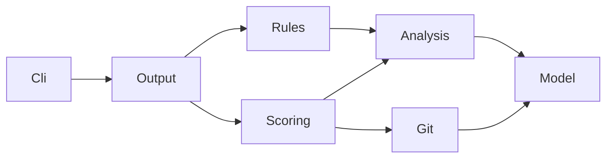

# dotnet-coupling

> .NET ソリューションの結合度を可視化・スコアリングし、アーキテクチャの健全性を定量評価する静的解析 CLI ツール。

`dotnet-coupling` は、.NET ソリューション内の型間・プロジェクト間の結合関係を Roslyn セマンティック解析で抽出し、**結合強度（Strength）・構造距離（Distance）・変更頻度（Volatility）** の3軸でリスクをスコアリングします。

CI パイプラインに組み込むことで、アーキテクチャ劣化を定量的に検出し、品質ゲートとして機能します。

## 主な機能

- 🔍 **セマンティック依存解析** — Roslyn `MSBuildWorkspace` による正確な型解決
- 📊 **リスクスコアリング** — Strength × Distance × Volatility の3軸モデル
- 🏷️ **グレード判定** — リポジトリ全体を A〜F で評価（CI ゲート対応）
- 🔥 **ホットスポット検出** — 高リスクの結合をピンポイントで特定
- ⚠️ **ルール違反検出** — レイヤー違反・循環依存・具象依存の3種
- 📁 **複数出力形式** — コンソール / JSON / Markdown
- 🌿 **Git 連携** — 直近90日の変更頻度を Volatility に反映
- 🛡️ **フォールバック** — セマンティック解析失敗時は syntax-only モードに自動降格

## 次のステップ

- [Getting Started](/getting-started) — インストールからはじめての解析まで
- [CLI リファレンス](/cli-reference) — 全オプションと終了コード
- [スコアリング仕様](/scoring) — Risk / Grade / Strength / Distance / Volatility の確定式

## アーキテクチャ

`Model` は他のプロジェクトに依存しません（依存方向: `Cli → Output → {Rules, Scoring} → {Analysis, Git} → Model`）。
